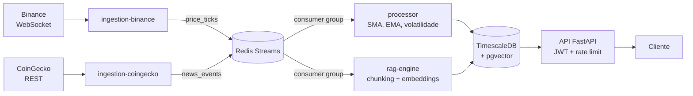
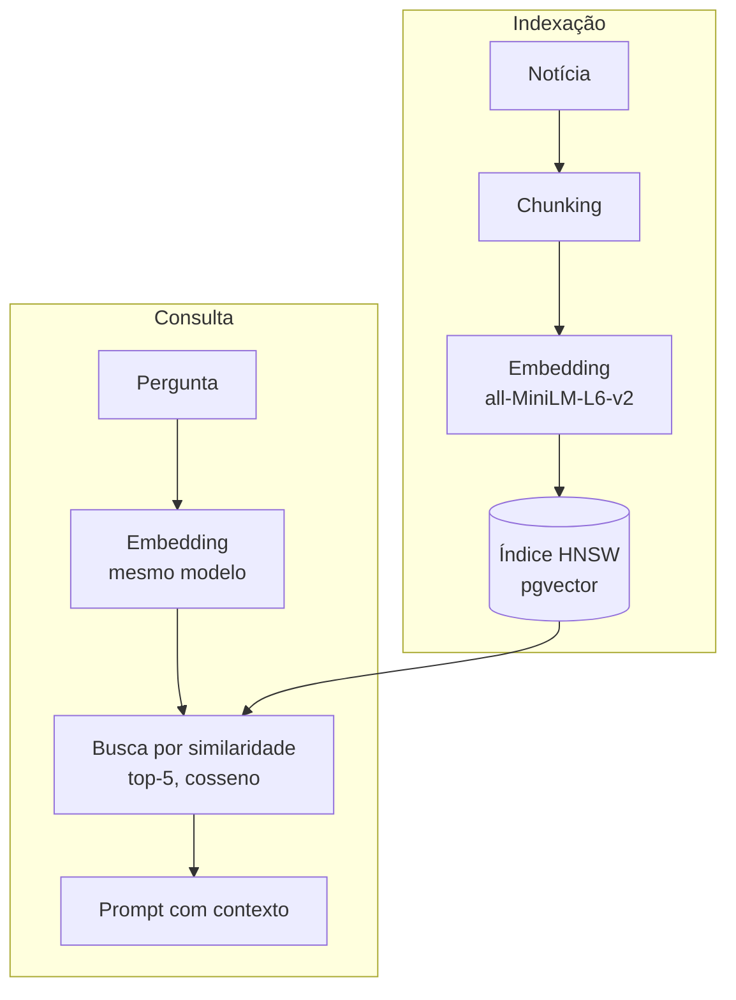

# 📈 Crypto AI Platform

Plataforma de análise de criptomoedas em **tempo real**, construída como arquitetura de **microsserviços orientada a eventos**. Ela ingere preços via WebSocket da Binance, calcula indicadores técnicos em streaming e indexa notícias em um banco vetorial para responder perguntas sobre o mercado com **RAG** (Retrieval-Augmented Generation).


> 🚧 **Status:** em desenvolvimento. Ingestão, processamento em streaming, indexação vetorial e API estão implementados. Geração de respostas com LLM e deploy em Kubernetes estão no roadmap.

## 🏗️ Arquitetura



Os produtores (ingestão) e os consumidores (processamento e RAG) são **desacoplados pelo Redis Streams**. Cada consumidor lê pelo seu próprio *consumer group*, então o mesmo evento pode ser processado por mais de um serviço, e múltiplas réplicas de um mesmo serviço dividem a carga automaticamente.

### Trilhas do RAG



O mesmo modelo de embeddings é usado nas duas trilhas, porque vetores de modelos diferentes não são comparáveis no mesmo índice.

## 🧩 Serviços

| Serviço | Responsabilidade | Estratégia de escala planejada |
|---|---|---|
| `ingestion-binance` | Consome o WebSocket de trades da Binance (BTC/USDT) com reconexão e backoff exponencial | Réplicas fixas |
| `ingestion-coingecko` | Polling da API do CoinGecko a cada 5 minutos para atualizações do projeto | Réplicas fixas |
| `processor` | Calcula SMA, EMA e volatilidade em janela deslizante de 20 ticks e persiste no TimescaleDB | HPA por tamanho de fila (KEDA) |
| `rag-engine` | Divide notícias em chunks, gera embeddings e indexa no pgvector | HPA por CPU |
| `api` | API REST com autenticação JWT e rate limiting por IP | HPA por CPU/latência |

## 📐 Decisões de arquitetura

As principais decisões estão documentadas como **ADRs** (Architecture Decision Records), com contexto, alternativas consideradas e consequências:

- [ADR 0001: Redis Streams como message broker](docs/adr/0001-message-broker-choice.md), com Kafka como caminho de evolução caso o volume cresça.
- [ADR 0002: pgvector no mesmo Postgres](docs/adr/0002-vector-db-same-postgres.md) em vez de um vector DB dedicado, para ter menos infraestrutura para operar e permitir consultas que combinam filtros relacionais e similaridade.
- [ADR 0003: autoscaling diferente por workload](docs/adr/0003-hpa-strategy.md), em que cada serviço escala pelo sinal que reflete sua carga real.

Detalhes completos em [`docs/architecture.md`](docs/architecture.md).

## 🔌 Endpoints da API

| Método | Rota | Descrição | Limite |
|---|---|---|---|
| `GET` | `/health` | Health check | — |
| `GET` | `/prices/{symbol}` | Últimos 100 preços do ativo | 60/min |
| `GET` | `/indicators/{symbol}` | Últimos 50 indicadores (SMA, EMA, volatilidade) | 60/min |
| `POST` | `/ask` | Recupera as notícias mais relevantes para a pergunta e monta o prompt com contexto | 10/min |

Todas as rotas, exceto `/health`, exigem `Authorization: Bearer <token>`. A documentação interativa fica em `/docs`.

## 🚀 Como executar

**Pré-requisitos:** Docker e Docker Compose.

```bash
git clone https://github.com/BrunoSakamoto/crypto-ai-platform.git
cd crypto-ai-platform
cp .env.example .env
docker compose up --build
```

A API sobe em [http://localhost:8000/docs](http://localhost:8000/docs). O `docker compose` inicializa o TimescaleDB com as extensões e tabelas definidas em [`sql/init.sql`](sql/init.sql).

### Testes

```bash
pip install -r tests/requirements-test.txt
pytest tests/ -v
```

A pipeline de CI (GitHub Actions) roda os testes e o lint com `ruff` e faz o build da imagem Docker de cada serviço.

## 📁 Estrutura

```
crypto-ai-platform/
├── services/
│   ├── ingestion-binance/    # WebSocket → Redis Streams
│   ├── ingestion-coingecko/  # Polling REST → Redis Streams
│   ├── processor/            # Indicadores técnicos → TimescaleDB
│   ├── rag-engine/           # Embeddings → pgvector
│   └── api/                  # FastAPI, JWT, rate limiting
├── sql/init.sql              # Schema: hypertables + índice vetorial HNSW
├── docs/                     # Arquitetura e ADRs
├── infra/helm/               # Charts de Kubernetes (planejado)
├── tests/
└── docker-compose.yml
```

## 🔭 Roadmap

- [x] Ingestão de preços (Binance) e dados do CoinGecko
- [x] Pipeline assíncrono com Redis Streams e consumer groups
- [x] Cálculo de indicadores técnicos em streaming
- [x] Indexação vetorial de notícias e busca por similaridade (pgvector)
- [x] API REST com JWT e rate limiting
- [ ] Geração de respostas com LLM no endpoint `/ask`
- [ ] Endpoint de emissão de token de acesso
- [ ] Suporte a múltiplos pares de moedas
- [ ] Deploy em Kubernetes com Helm
- [ ] Autoscaling com KEDA (fila) e HPA (CPU)
- [ ] Avaliação offline da qualidade do RAG
- [ ] Observabilidade com Prometheus e Grafana

## 👤 Autor

**Bruno Sakamoto**, Engenheiro de Dados
